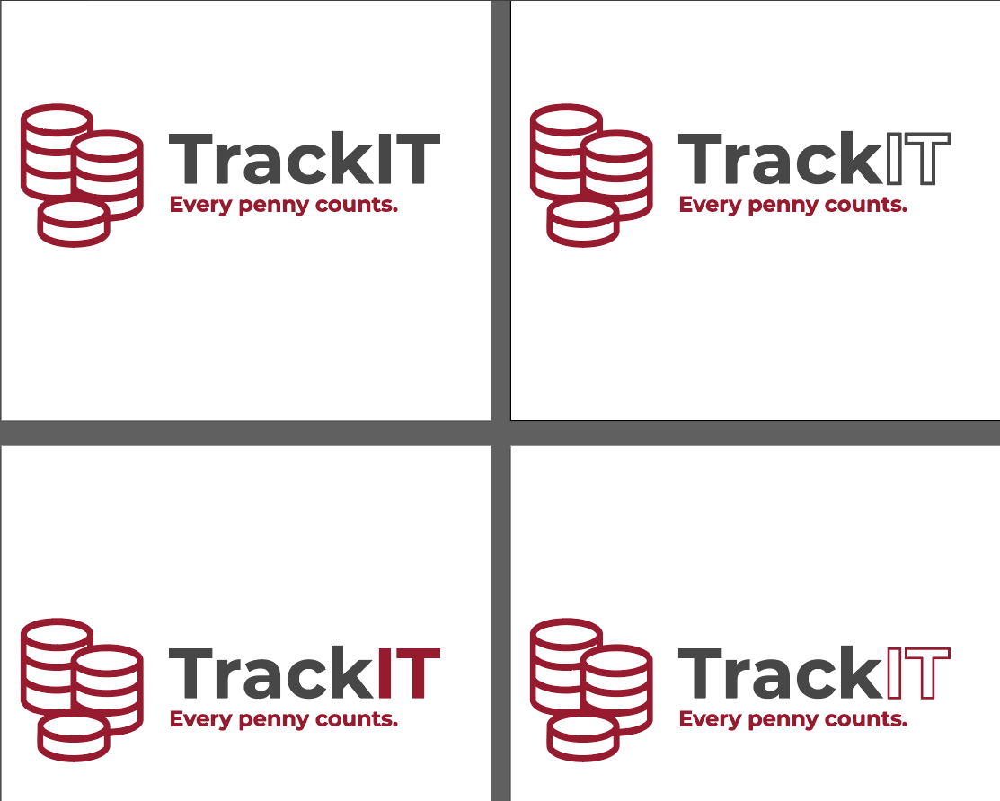

### TrackIT

### Table of Contents
- [1. Plan](#1-plan)
  - [1.1 Decisions](#11-decisions)
    - [Money Tracker](#money-tracker)
    - [Forums, Discord, Reddit-Type Platform](#forums-discord-reddit-type-platform)
    - [Portfolio Webpage with Admin and Normal Accounts](#portfolio-webpage-with-admin-and-normal-accounts)
  - [**Final Decision**](#final-decision)
- [2. Preparation](#2-preparation)
  - [2.1 Colors](#21-colors)
  - [2.2 Logo](#22-logo)
  - [**Final Logo Choice:**](#final-logo-choice)
- [3. MVP](#3-mvp)

## 1. Plan
### 1.1 Decisions
Before starting this project, I considered two ideas:

#### Money Tracker
**Pros:**
- Provides greater control over money usage and savings.
- Allows full financial management, including tracking recurring expenses like subscriptions.
- Extremely useful for the future, especially when moving out.

**Cons:**
- Involves a lot of math.
- Uncertainty about the website’s design.
- Requires relearning and learning new concepts.

#### Forums, Discord, Reddit-Type Platform
**Pros:**
- Opportunity to learn about multiple user accounts (admin, regular users, etc.).
- Gain knowledge on how to implement posting, image uploads, and other features.

**Cons:**
- Steep learning curve due to the complexity of new features.

#### Portfolio Webpage with Admin and Normal Accounts
**Pros:**
- A chance to create a better portfolio website.
- Learn how to implement different user roles with varied privileges.
- Already familiar with the basics, reducing development time.

**Cons:**
- Requires building another portfolio webpage.
- Might take time due to the need to refresh CSS and JavaScript skills.

### **Final Decision**
I chose **Money Tracker** because it will be highly beneficial for me and other students.

---
## 2. Preparation
Before diving into development, I completed three preliminary steps:

### 2.1 Colors
In my previous projects, I mainly used light color themes. This time, I opted for a dark theme. I chose a deep black color: **#1E1E1E** instead of pure black (**#000000**) since it adds more depth to the design.

### 2.2 Logo
Since I started early, I decided to create a logo for the project. The process involved two steps:

1. Choosing a name that represents money tracking. I settled on **TrackIT**.
2. Designing multiple logo versions:

I gathered feedback from others regarding the best version:
- **Top Left**
  - Original design.
- **Top Right**
  - First revision.
  - _"I like this one more since it introduces a new color into the picture."_ – Simen
- **Bottom Right**
  - Second revision.
  - _"I like that you are surrounding the middle part with colors."_ – Alf Morten
- **Bottom Left**
  - Final revision.
  - _"This one fits better with UX since it’s easier to read and less confusing than the one with lines."_ – Random Student

### **Final Logo Choice:**
- **For dark backgrounds:**  
  
- **For light backgrounds:**  
  

---
## 3. MVP
The next step involves defining the Minimum Viable Product (MVP) to ensure a functional and efficient initial version of TrackIT.

- The MVP will consist of:
  - Registration feature allowing users to create an account with:
    - Email, password, and phone number.
  - Login functionality enabling users to sign into the website with their created accounts.
  - Completed CSS for the welcome page, login, and registration forms.

